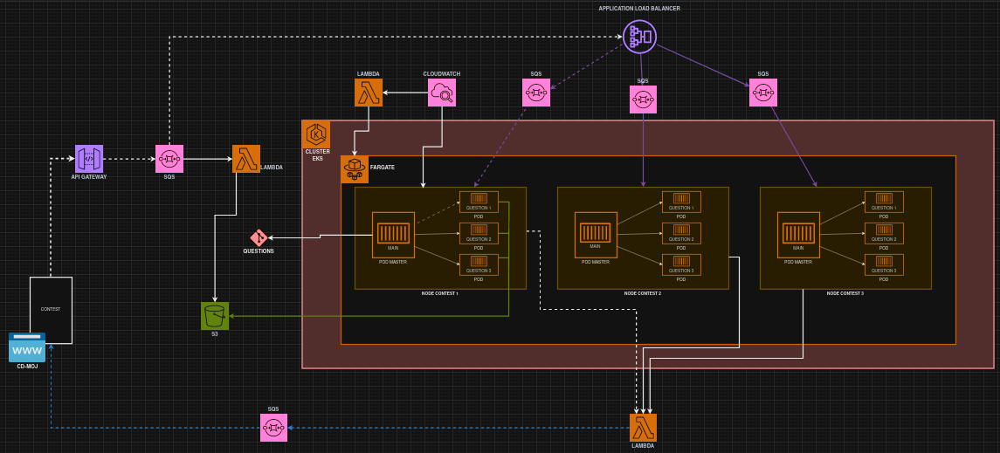

# Nimbus Judge
# Nimbus Judge

Welcome to Nimbus Judge, an innovative coding competition and assessment platform developed by students from the University of Brasília (UnB) under the Institutional Program of Scholarships for Initiation in Technological Development and Innovation (PIBITI). Our mission is to revolutionize the way programming assessments are conducted at UnB, offering a more responsive and scalable solution that caters specifically to the needs of students and educators.

## About Nimbus Judge

Nimbus Judge emerged from the need to improve upon the existing assessment system, CD-moj, utilized extensively at the Faculty of Gama (FGA), a hub specializing in engineering disciplines, particularly software engineering. Named 'Nimbus' to signify its cloud-based operation—leveraging the power and flexibility of cloud computing through Amazon Web Services (AWS)—our platform promises high availability and scalability, which are critical for handling the extensive and varied demands of programming competitions and academic assessments.

## Vision and Goals

- **Responsive System:** Decreasing wait times for analysis and results of submissions, providing instant feedback to users.
- **Scalability:** Capable of managing a large influx of users and submissions without degradation in performance.
- **Student-Focused Design:** Tailored to enhance the educational experience, making it easier for both students and professors to engage in and benefit from the platform.

## Project Timeline

- **Start Year:** 2023
- **End Year:** 2024 (with ongoing development post-project completion)

## Key Features

- **Cloud-Based Infrastructure:** Utilizing AWS for a robust, secure, and continuously available service.
- **User-Friendly Interface:** Designed with the end-user in mind to ensure ease of use for students and faculty.
- **Automatic Code Evaluation:** Offers timely and precise feedback for coding assignments and competition submissions.

## Current Architecture

The project is in the planning stage of an ideal architecture that will detail every operational process, starting from simple implementations and evolving based on user feedback and system demands. 

## Contributing

We actively encourage contributions from the UnB community and beyond. If you have ideas for features, code improvements, or any other enhancements, we would love to hear from you.

### How to Contribute

1. **Fork the Repository:** Start by forking the repository and cloning it locally.
2. **Create a Branch:** Create a new branch for your changes.
3. **Implement Changes:** Work on your improvements or features.
4. **Submit a Pull Request:** Push your changes to your fork and submit a pull request to our main branch for review.

## Development Team

- Our team includes six passionate developers from UnB, dedicated to making Nimbus Judge a benchmark in academic and competition coding assessments.

<table style="margin-left: auto; margin-right: auto;">
    <tr>
        <td align="center">
            <a href="https://github.com/Gxaite">
                
                <h5 class="text-center">Gabriel Scheidt</h5>
            </a>
        </td>
        <td align="center">
            <a href="https://github.com/isaacbatista26">
                
                <h5 class="text-center">Isaac Batista</h5>
            </a>
        </td>
        <td align="center">
            <a href="https://github.com/rafaelcarvalhoj">
                
                <h5 class="text-center">Rafael Carvalho</h5>
            </a>
        </td>
        </td>
        <td align="center">
            <a href="https://github.com/anajoyceamorim">
                
                <h5 class="text-center">Ana Joyce</h5>
            </a>
        </td>
        <td align="center">
            <a href="https://github.com/johan-rocha">
                
                <h5 class="text-center">Johan Rocha</h5>
            </a>
        </td>

</table>

## Histórico de versão

| Versão |    Data    |                Descrição                |      Autor      |
| :----: | :--------: | :-------------------------------------: | :-------------: |
| 2.0    | 13/04/2024    | Adicionando descrição para a gitpage | Gabriel Scheidt |
|  1.0   | 11/04/2024 | Iniciando Documentação com GitHub Pages | Rafael Carvalho |
